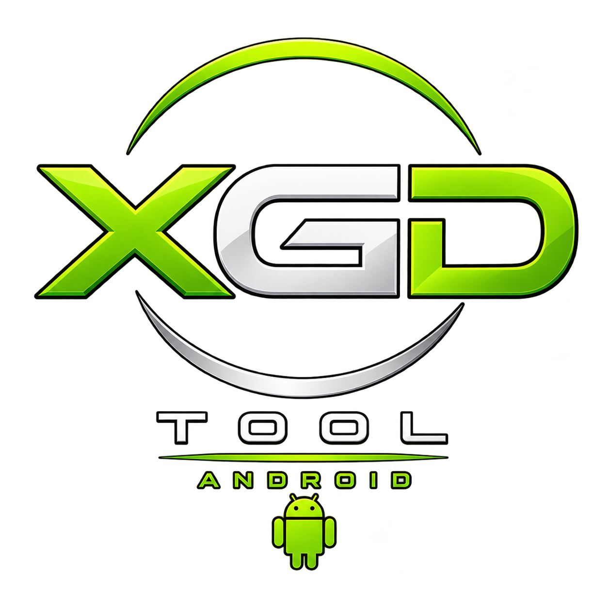

<p align="center">
  &nbsp;&nbsp;&nbsp;&nbsp;&nbsp;&nbsp;&nbsp;&nbsp;
  
</p>

<p align="center">
  <b>High-Performance Xbox & Xbox 360 Disc Image Converter & Suite</b><br>
  Unified native support for <b>Windows (GUI & CLI)</b> and <b>Android (Material 3 Dark)</b>
</p>

<p align="center">
  <a href="https://github.com/Ashnar2602/XGDTool/releases/latest"></a>
  <a href="https://github.com/Ashnar2602/XGDTool/blob/master/LICENSE"></a>
  
  
  <a href="https://github.com/Ashnar2602/XGDTool/wiki"></a>
</p>

---

## 📖 Overview

**XGDTool** (High-Performance Fork by **[Ashnar2602](https://github.com/Ashnar2602)**, based on the original utility by **[WiredOpposite](https://github.com/wiredopposite/XGDTool)**) is a modern, unified conversion and disc optimization toolchain for **Original Xbox** and **Xbox 360** game discs.

Whether running on a multi-core Windows desktop or on an Android smartphone, XGDTool converts, scrubs, verifies, and packages disc images at maximum storage controller throughput, with zero external runtime dependencies.

---

## ⚡ Highlights of the v1.4 Engine & QoL Overhaul

* 🚀 **Vectorized & Hardware-Accelerated CRC32**:
  Native ARMv8 ACLE assembly (`__crc32d`) delivering **15–20 GB/s** on mobile ARM64 devices, and Slice-by-8 vectorized algorithm on x86_64 processing 8 bytes/cycle in L1 cache (**4–5 GB/s per core**).
* ⚡ **Asynchronous Double-Buffering Ring Pipeline**:
  Prefetches uncompressed data blocks in background (`std::async`) while worker threads compress the current buffer, completely hiding disk read latency behind CPU passes.
* 💾 **OS Storage Sequential Hints & Zero-Fragmentation Pre-allocation**:
  Kernel hints (`FILE_FLAG_SEQUENTIAL_SCAN` and `POSIX_FADV_SEQUENTIAL`) and pre-allocation (`posix_fallocate` / `resize_file`) prevent disk cluster fragmentation during extraction.
* 📊 **Live Throughput (MB/s) & Dynamic ETA Countdown**:
  Accurate rolling transfer speed (`MB/s`) and formatted ETA countdown (`hh:mm:ss`) updated in real time in both the CLI progress bar and GUI interface.
* 🔍 **Diagnostic Image Verification Mode (`--verify` / UI Button)**:
  Non-destructive integrity scanner inspecting disc geometry (XGD2/XGD3, layer break), AVL filesystem structure, Title ID, Title Name, and streaming checksums (CRC32, MD5, SHA-1).
* 🏷️ **Smart Game Renamer (`--smart-rename` / UI Option)**:
  Automatically names output files and folders following the standard `[<TitleID>] <GameName>` convention.
* 🖥️ **Windows Explorer Context Menu Integration**:
  Instant non-elevated right-click registration (`--register-shell`) for `.iso`, `.xiso`, `.cso`, `.cci`, and `.zar`.
* 📱 **Zero-Copy Android Storage Engine**:
  Converts directly in place via `MANAGE_EXTERNAL_STORAGE` and real SAF path resolution, eliminating 15–20 GB of duplicate cache overhead.
* 🔒 **Lock-Free Multithreaded Compression**:
  Coarse-grained batch coordinators with atomic work-stealing saturate all CPU cores for **CSO** and **CCI** compression without mutex contention.
* 📦 **Parallel Multi-Core ZArchive (Zstd)**:
  Compresses 4 MB data block batches concurrently across all CPU threads with dedicated Zstd contexts, supporting compression levels 1 through 6 while preserving ~2 GB/s emulator decompression speeds.
* 🎮 **Full Format Interoperability**:
  Bidirectional conversions between **ISO / XISO**, **CSO**, **CCI**, **GoD (Games on Demand)**, **ZAR (ZArchive)**, and **Extracted Loose Folders**.

---

## 📦 Download Releases

Pre-compiled, standalone binaries are published on the **[Releases Page](https://github.com/Ashnar2602/XGDTool/releases)**:

| Target | Binary Name | Description |
| :--- | :--- | :--- |
| **Windows GUI** | `XGDTool-GUI.exe` | Standalone modern GUI with Dark Theme, Drag & Drop queue manager, and live progress. |
| **Windows CLI** | `XGDTool-CLI.exe` | Lean, single-file command-line executable for automation, terminal workflows, and scripting. |
| **Android APK** | `XGDTool-Android.apk` | Native Android app with Material 3 Xbox Dark UI, Zero-Copy storage, and background service. |

---

## 🔄 Supported Formats

| Format | Extension | Type | Recommended Use Case | Compatible Targets |
| :--- | :--- | :--- | :--- | :--- |
| **ISO / XISO** | `.iso` | Raw / Scrubbed Disc | Burning to DVD+R DL, raw backups | Original Xbox, Xbox 360, Xemu, Xenia |
| **CSO** | `.cso` | LZ4 Block-Compressed | Space saving with instant random read | Xbox Emulators (Xemu) |
| **CCI** | `.cci` | LZ4 Chunk-Compressed | High-speed compressed Xbox disc image | Original Xbox Emulators |
| **GoD** | Container folder | Uncompressed Chunks | Direct USB / HDD execution | Xbox 360 RGH/JTAG, Aurora, FreestyleDash, Xenia |
| **ZAR** | `.zar` | Zstandard (Zstd) Archive | Ultra-compact archive for cold storage | Cemu, Specialized Emulators, PC Archives |
| **Extract** | Directory | Loose Files | Modding, asset inspection, homebrew | Xbox 360 Aurora, Dashboard, PC Modding |

---

## 🚀 Quick Start

### 🖥️ Windows GUI
1. Launch `XGDTool-GUI.exe`.
2. Drag and drop any `.iso`, `.zar`, `.cso`, `.cci`, or game folder into the window.
3. Select your target format (e.g. `XISO`, `ZAR`, `GoD`).
4. Click **Start** to process all queued files.

### 💻 Windows Command-Line (CLI)
```powershell
# Convert an ISO to Games on Demand (GoD) format for Xbox 360 RGH
XGDTool-CLI.exe --god "D:\Games\Halo_Reach.iso" "E:\X360_USB\Content\0000000000000000"

# Convert a ZAR archive back to standard uncompressed XISO
XGDTool-CLI.exe --xiso "D:\Backups\Dantes_Inferno.zar" "D:\Extracted_ISOs"

# Reauthor an ISO with Full Scrub and calculate streaming checksums
XGDTool-CLI.exe --xiso --full-scrub --checksum "D:\Games\Game.iso"

# Convert multiple images in parallel using 8 CPU worker threads
XGDTool-CLI.exe --cso --threads 8 "D:\Games"
```

### 📱 Android App
1. Install `XGDTool-Android.apk` on Android 8.0+ (ARM64).
2. Tap **Sorgente (Input)** to select your disc image or folder.
3. Tap **Destinazione (Output)** to choose your target folder.
4. When prompted, enable **All Files Access** to activate high-speed **Zero-Copy** mode.
5. Select your desired format and tap **Avvia Conversione**. The app runs as a foreground service with live notification progress.

---

## 📚 Documentation & Wiki

Detailed guides, format specifications, and user manuals in 7 languages are hosted on the **[Official GitHub Wiki](https://github.com/Ashnar2602/XGDTool/wiki)**:

* 🌐 **User Manuals**:
  * 🇮🇹 [Guida all'Uso (Italiano)](https://github.com/Ashnar2602/XGDTool/wiki/Guida-Uso-Italiano)
  * 🇬🇧 [User Manual (English)](https://github.com/Ashnar2602/XGDTool/wiki/User-Manual-English)
  * 🇩🇪 [Benutzerhandbuch (Deutsch)](https://github.com/Ashnar2602/XGDTool/wiki/User-Manual-German)
  * 🇪🇸 [Manual de Usuario (Español)](https://github.com/Ashnar2602/XGDTool/wiki/User-Manual-Spanish)
  * 🇫🇷 [Manuel Utilisateur (Français)](https://github.com/Ashnar2602/XGDTool/wiki/User-Manual-French)
  * 🇵🇹 [Manual do Usuário (Português)](https://github.com/Ashnar2602/XGDTool/wiki/User-Manual-Portuguese)
  * 🇨🇳 [用户手册 (简体中文)](https://github.com/Ashnar2602/XGDTool/wiki/User-Manual-Chinese)
* ⚙️ **Technical Guides**:
  * ⚡ [Zero-Copy Storage Engine & Performance Architecture](https://github.com/Ashnar2602/XGDTool/wiki/Zero-Copy-Storage-Architecture)
  * 📊 [Supported Formats, Technical Specifications & Emulators](https://github.com/Ashnar2602/XGDTool/wiki/Formats-Comparison-and-Specifications)
  * 🛠️ [Building XGDTool from Source Guide](https://github.com/Ashnar2602/XGDTool/wiki/Building-from-Source)

---

## 🛠️ Building from Source

### Windows (CMake & MSVC 2022)
```powershell
git clone --recursive https://github.com/Ashnar2602/XGDTool.git
cd XGDTool

# Build GUI Target
cmake -B build -S .
cmake --build build --config Release -j

# Build Standalone CLI Target
cmake -B build_cli -S . -DBUILD_CLI_ONLY=ON
cmake --build build_cli --config Release -j
```

### Android (Gradle Wrapper)
```powershell
cd android
.\gradlew.bat assembleRelease
# Output APK: android/app/build/outputs/apk/release/app-release.apk
```

---

## ⚖️ License & Attribution

* **XGDTool** is licensed under the **GNU General Public License v3.0 (GPL-3.0)**. See [LICENSE](LICENSE) for details.
* **Maintainer (v1.2+ / v1.3+)**: **[Ashnar2602](https://github.com/Ashnar2602)**
* **Original Author**: **[WiredOpposite](https://github.com/wiredopposite/XGDTool)**
* Embedded third-party components (lz4, zstd, ZArchive, Repackinator) retain their respective open-source licenses as documented in the codebase.
